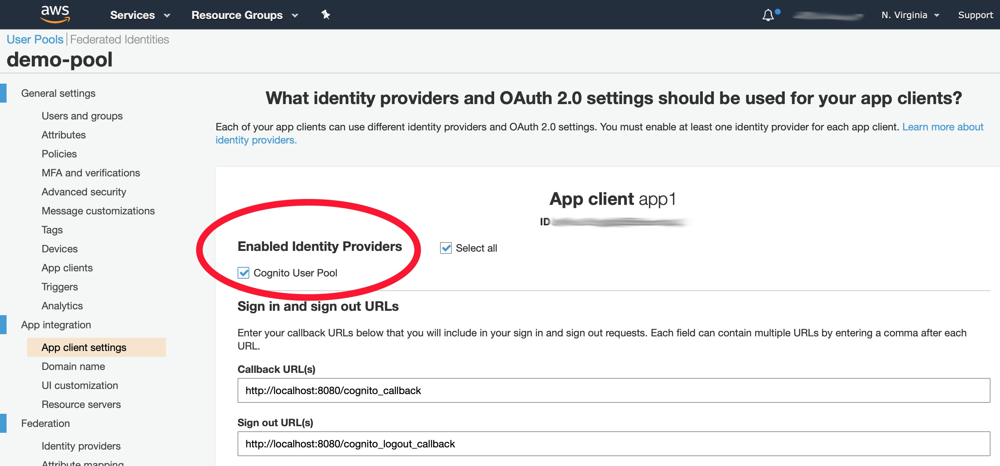

# Cognito Terraform Setup

This section of the project contains Terraform and related scripts to get a Cognito environment set-up.

## Preparation

This solution assumes you are storing your Terraform state in AWS S3 and DynamoDB. This section quickly explains what you need to do to set this up.

__IMPORTANT__ In the `terraform/backend.tf` file, you need to set a different S3 bucket name than the one supplied. S3 bucket names have to be globally unique. The one in the file is just an example, but there's a good change someone will use it - and it's a first-come-first-serve kinda thing.

You can either modify the `terraform/backend.tf` file yourself to suite your needs, or continue through this section to run the preparation script that will setup your AWS backend.

Assuming all the requirements (see root [README](../README.md)) are met, you can run the following, assuming you are in the base directory of the project:

_Note_: You may need to set your AWS credentials. The first two commands is for setting your AWS administrative credentials.

_Note_: Use `./prepare_terraform_backend.py -h` for more detailed usage information, for example, to specify a specific S3 bucket name

```
(venv) $ export AWS_ACCESS_KEY_ID=xxxxxxxxxxxxxxxx
(venv) $ export AWS_SECRET_ACCESS_KEY=xxxxxxxxxxxxxxxx
(venv) $ cd cognito
(venv) $ ./prepare_terraform_backend.py 
```

## Usage

First, check that the Terraform execution plan should work and create an execution plan file:

```bash
(venv) $ cd terraform
(venv) $ terraform plan -out=exec_plan
```

When there is no errors and you are happy with the output, implement the plan:

```bash
(venv) $ terraform apply exec_plan
...lots of output

Outputs:
           
app_1_id = xxxxxxxxxxxxxxxxxxxxxxxxxx
app_1_secret = xxxxxxxxxxxxxxxxxxxxxxxxxxxxxxxxxxxxxxxxxxxxxxxxxxxx
user_pool_arn = arn:aws:cognito-idp:us-east-1:xxxxx:userpool/us-east-1_xxxxx
user_pool_domain_name = https://demo-pool-domain-xxxxx.auth.eu-west-2.amazoncognito.com
user_pool_endpoint = cognito-idp.us-east-1.amazonaws.com/us-east-1_xxxxx
user_pool_id = us-east-1_xxxxx
```

__Note__: Take note of the `Outputs` as you will need this for your Flask application.

At any point, if you need to get the output again, run the following in the `terraform` directory:

```bash
(venv) $ terraform show -json | python3 -m json.tool 
{
    "format_version": "0.1",
    "terraform_version": "0.12.24",
    "values": {
        "outputs": {
            "app_1_id": {
                "sensitive": false,
                "value": "xxxxxxxxxxxxxxxxxxxxxxxxxx"
            },
            "app_1_secret": {
                "sensitive": false,
                "value": "xxxxxxxxxxxxxxxxxxxxxxxxxxxxxxxxxxxxxxxxxxxxxxxxxxxx"
            },
            "user_pool_arn": {
                "sensitive": false,
                "value": "arn:aws:cognito-idp:us-east-1:xxxxx:userpool/us-east-1_xxxxx"
            },
            "user_pool_domain_name": {
                "sensitive": false,
                "value": "https://demo-pool-domain-xxxxx.auth.eu-west-2.amazoncognito.com"
            },
            "user_pool_endpoint": {
                "sensitive": false,
                "value": "cognito-idp.us-east-1.amazonaws.com/us-east-1_xxxxx"
            },
            "user_pool_id": {
                "sensitive": false,
                "value": "us-east-1_xxxxx"
            }
        },
        .....more output.....
    }
}
```

__IMPORTANT FINAL STEP__

The one thing that Terraform doesn't do is to enable the Cognito User Pool for the client - you have to do this on the console (I could not yet find an API call to do this either).


